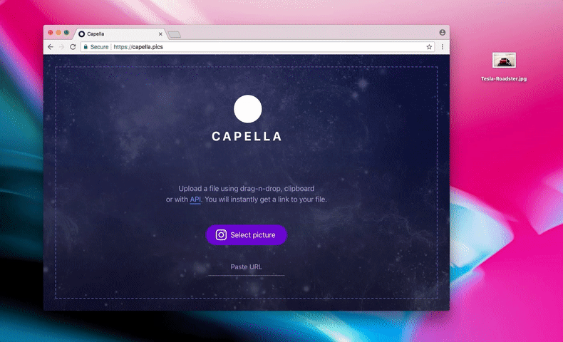

# [Сapella](https://capella.pics)

Cloud service for image storage and delivery. Upload files and accept image-filters on the fly with the simple API.

Made with :heart: by [CodeX](https://codex.so)

[](https://capella.pics/image/0351d892-44ba-4c5f-9d34-0af0f9e33651)

> :warning: Warning
>
> https://capella.pics is currently in beta. Uploading a large number of files is not supported.

## Content

* [Usage](#usage)
* [Capella SDKs](#capella-sdks)
* [Upload API](#upload-api)
    * [Request](#request)
    * [Response](#response)
    * [Examples](#examples)
* [Get image](#get-image)
    * [Filters](#filters)
* [Development and deployment](#development-and-deployment)
* [Issues and improvements](#issues-and-improvements)

## Usage

1. Use [capella.pics](https://capella.pics) site, [SDK](#capella-sdks) or [API](#upload-api) to upload an image.

2. Add filters to uploaded image's URL and get processed image.

### File requirements

Maximum size for the file is `15MB`.

Capella supports these types of images:

- jpg
- jpeg
- png
- gif
- bmp
- tiff

Please note that each uploaded file will be converted to JPG with a white background and quality 90.

## Capella SDKs

- [PHP](https://github.com/codex-team/capella.php)
- [Node.js](https://github.com/codex-team/capella.nodejs)
- [Go](https://github.com/codex-team/capella.go)
- [Python](https://github.com/codex-team/pycapella)
- [Scala](https://github.com/codex-team/capella.scala)

## Upload API

### Request

You can upload image file or send link to the image from your app by making a request to `https://capella.pics/upload`.

| Method | URI      | Data                      |
|--------|----------|---------------------------|
| `POST` | `upload` | file in `file` field      |
| `POST` | `upload` | image url in `link` field |

You will get a JSON response from server.

### Response

Each response will have at least `success` and `message` fields.

| Field     | Type    | Description       |
|-----------|---------|-------------------|
| `success` | Boolean | Request validness |
| `message` | String  | Result message    |

#### Success

| Field     | Type    | Description or value            |
|-----------|---------|---------------------------------|
| `success` | Boolean | `true`                          |
| `message` | String  | `Image uploaded`                |
| `id`      | String  | Image id                        |
| `url`     | String  | Full link to the uploaded image |
| `mime`    | String  | Mime type of the uploaded image |
| `width`   | Integer | Image's width                   |
| `height`  | Integer | Image's height                  |
| `color`   | String  | Average hex color of the image  |
| `size`    | Integer | Image's size in bytes           |

```json
{
    "success": true,
    "message": "Image uploaded",
    "id": "69256e83-66e1-449a-b0c2-5414d332e3a6",
    "url": "https:\/\/capella.pics\/69256e83-66e1-449a-b0c2-5414d332e3a6.jpg",
    "mime": "image\/jpg",
    "width": 1080,
    "height": 700,
    "color": "#9d908d",
    "size": "176769"
}
```

#### Failure

| Field     | Type    | Description or value          |
|-----------|---------|-------------------------------|
| `success` | Boolean | `false`                       |
| `message` | String  | Reason why request was failed |

```json
{
    "success": false,
    "message": "Wrong source mime-type"
}
```

#### List of messages for failed requests

| Message                          |  Description                          |
|----------------------------------|---------------------------------------|
| `Method not allowed`             | Request method is not POST            |
| `File or link is missing`        | No expected data was found            |
| `File is missing`                | Filename is missing                   |
| `Link is missing`                | Field link is empty                   |
| `Wrong source mime-type`         | No support file with this mime-type   |
| `Source is too big`              | File size exceeds the limit           |
| `Source is damaged`              | Source has no data, size or mime-type |
| `Can't get headers for this URL` | Wrong url was passed                  |

### Examples

#### CURL

```bash
# Upload file

curl -X POST https://capella.pics/upload -F "file=@/path/to/image.png"
```

```bash
# Upload image by link

curl -X POST https://capella.pics/upload -d "link=https://path.to/image.png"
```

#### Python

```python
# Upload file

import requests
import json

files = {
    'file': open('./image.png','rb')
}

r = requests.post('https://capella.pics/upload', files=files)
response = json.loads(r.content)

print(response)
```

```python
# Upload image by link

import requests
import json

data = {
    'link': 'https://path.to/image.png'
}

r = requests.post('https://capella.pics/upload', data=data)
response = json.loads(r.content)

print(response)
```

## Getting image

You can get each uploaded image by the following URL scheme with or without extension.

`https://capella.pics/<image_id>` or `https://capella.pics/<image_id>.jpg`

[](https://capella.pics/69256e83-66e1-449a-b0c2-5414d332e3a6)

### Filters

Apply filter by adding it at the end of the image URL.

`https://capella.pics/<image_id>/<filter>/<params>`

You can use as many filters as you want.

`/<filter_1>/<params_1>/<filter_2>/<params_2>...`

Note that the order of filters affects the result:

| Filter                 | Result                                                                        |
|------------------------|-------------------------------------------------------------------------------|
| `/resize/100/crop/200` | [![][codex-stickers-resize-100-crop-200]][codex-stickers-resize-100-crop-200] |
| `/crop/200/resize/100` | [![][codex-stickers-crop-200-resize-100]][codex-stickers-crop-200-resize-100] |

[codex-stickers-resize-100-crop-200]: https://capella.pics/69256e83-66e1-449a-b0c2-5414d332e3a6/resize/100/crop/200
[codex-stickers-crop-200-resize-100]: https://capella.pics/69256e83-66e1-449a-b0c2-5414d332e3a6/crop/200/resize/100

#### Resize

Scale the image to the largest size such that both its width and its height can fit inside the target rectangle.

| Param    | Type    | Description                                                                  |
|----------|---------|------------------------------------------------------------------------------|
| `width`  | Integer | Maximum image`s width or maximum target square`s size if no height was given |
| `height` | Integer | (optional) Maximum image's height                                            |

Example: `https://capella.pics/<image_id>/resize/300x400`

| Filter                | Result                                                              |
|-----------------------|---------------------------------------------------------------------|
| `/resize/300x400`     | [![][codex-stickers-resize-300-400]][codex-stickers-resize-300-400] |
| `/resize/150`         | [![][codex-stickers-resize-150]][codex-stickers-resize-150]         |

[codex-stickers-resize-150]: https://capella.pics/69256e83-66e1-449a-b0c2-5414d332e3a6/resize/150
[codex-stickers-resize-300-400]: https://capella.pics/69256e83-66e1-449a-b0c2-5414d332e3a6/resize/300x400


#### Crop

Cover the target rectangle by the image. Nice tool for creating covers or profile pics.

| Param    | Type    | Description                                                             |
|----------|---------|-------------------------------------------------------------------------|
| `width`  | Integer | Target rectangle`s width or target square`s size if no height was given |
| `height` | Integer | (optional) Target rectangle height                                      |

Example: `https://capella.pics/<image_id>/crop/150`

| Filter              | Result                                                          |
|---------------------|-----------------------------------------------------------------|
| `/crop/150`         | [![][codex-stickers-crop-150]][codex-stickers-crop-150]         |
| `/crop/200x400`     | [![][codex-stickers-crop-200-400]][codex-stickers-crop-200-400] |
| `/crop/400x200`     | [![][codex-stickers-crop-400-200]][codex-stickers-crop-400-200] |

[codex-stickers-crop-150]: https://capella.pics/69256e83-66e1-449a-b0c2-5414d332e3a6/crop/150
[codex-stickers-crop-200-400]: https://capella.pics/69256e83-66e1-449a-b0c2-5414d332e3a6/crop/200x400
[codex-stickers-crop-400-200]: https://capella.pics/69256e83-66e1-449a-b0c2-5414d332e3a6/crop/400x200


##### Additional params

If you need to crop an area from specified point then pass these params.

Note that this way `width` and `height` will be size params for the cropped area.

| Param    | Type    | Description |
|----------|---------|-------------|
| `x`      | Integer | Left indent |
| `y`      | Integer | Top indent  |

Example: `https://capella.pics/<image_id>/crop/400x300&500,150`

| Filter                  | Result                                                                          |
|-------------------------|---------------------------------------------------------------------------------|
| `/crop/400x300&500,150` | [![][codex-stickers-crop-400-300-500-150]][codex-stickers-crop-400-300-500-150] |
| `/crop/300x400&200,150` | [![][codex-stickers-crop-300-400-200-150]][codex-stickers-crop-300-400-200-150] |

[codex-stickers-crop-400-300-500-150]: https://capella.pics/69256e83-66e1-449a-b0c2-5414d332e3a6/crop/400x300&500,150
[codex-stickers-crop-300-400-200-150]: https://capella.pics/69256e83-66e1-449a-b0c2-5414d332e3a6/crop/300x400&200,150

#### Pixelize

Render image using large colored blocks.

| Param     | Type    | Description                          |
|-----------|---------|--------------------------------------|
| `pixels`  | Integer | Number of pixels on the largest side |

Example: `https://capella.pics/<image_id>/pixelize/20`

| Filter         | Result                                                        |
|----------------|---------------------------------------------------------------|
| `/pixelize/20` | [![][codex-stickers-pixelize-20]][codex-stickers-pixelize-20] |
| `/pixelize/50` | [![][codex-stickers-pixelize-50]][codex-stickers-pixelize-50] |

[codex-stickers-pixelize-20]: https://capella.pics/69256e83-66e1-449a-b0c2-5414d332e3a6/pixelize/20
[codex-stickers-pixelize-50]: https://capella.pics/69256e83-66e1-449a-b0c2-5414d332e3a6/pixelize/50

#### Cover

Place image to cover.

| Param   | Type   | Description                                   |
|---------|--------|-----------------------------------------------|
| `color` | String | Hex code of cover's color without hash symbol | 

Example: `https://capella.pics/<image_id>/cover/eff2f5`

| Filter                | Result                                                                      |
|-----------------------|-----------------------------------------------------------------------------|
| `/cover/eff2f5`       | [![][codex-stickers-cover-eff2f5]][codex-stickers-cover-eff2f5]             |
| `/crop/150/cover/fee` | [![][codex-stickers-crop-150-cover-fee]][codex-stickers-crop-150-cover-fee] |

[codex-stickers-cover-eff2f5]: https://capella.pics/69256e83-66e1-449a-b0c2-5414d332e3a6/cover/eff2f5
[codex-stickers-crop-150-cover-fee]: https://capella.pics/69256e83-66e1-449a-b0c2-5414d332e3a6/crop/150/cover/fee

## Development and deployment

You can run your own Capella for usage or development. Follow our [development](docs/development.md) and [deployment](docs/deployment.md) guides.

## Issues and improvements

Ask a question or report a bug on the [create issue page](https://github.com/codex-team/capella/issues/new).

Know how to improve Capella? [Fork it](https://github.com/codex-team/capella) and send pull request.

You can also drop a few lines to [CodeX Team's email](mailto:team@codex.so).
