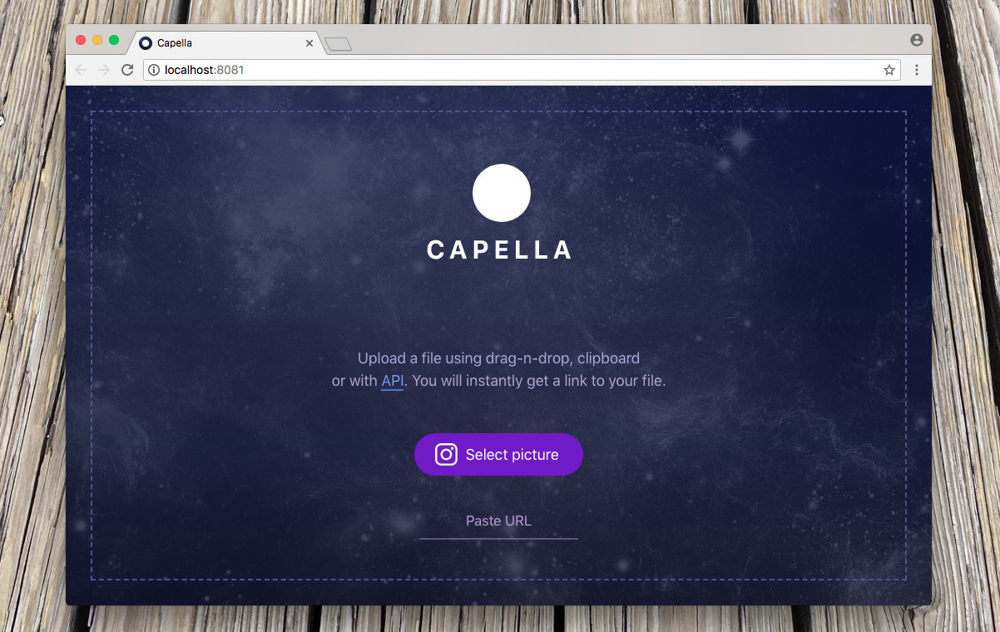

# How to deploy Capella

You can run a clone of Capella for development or usage as your own cloud service on production. There are two ways: Docker containers or set up environment by yourself.

## Docker

Make sure that you have installed [Docker](https://docs.docker.com/install/) and [docker-compose](https://docs.docker.com/compose/).

1. Clone this repository

```shell
git clone https://github.com/codex-team/capella
cd capella
```

2. In the repository's root build and run Docker containers

```shell
docker-compose build
docker-compose up
```

3. Run composer in PHP container 

Install all dependencies (including require-dev). Use it for development.

```shell
docker exec -i capella_php_1 composer install
```

If you need no dev-dependencies and you are going to run Capella on production then add flag `--no-dev`

```shell
docker exec -i capella_php_1 composer install --no-dev
```

4. Create `upload` dir for images in a subfolder `capella` with Capella's sources and set permissions.

```shell
cd capella
mkdir upload
chmod 777 upload
```

5. Create `.env` config file and fill up params.

You can copy env file skeleton from sample file `capella/capella/.env.sample`.

```shell
cp .env.sample .env
```

Capella uses [Hawk](https://hawk.so) as error catching service. You can create an account and add a new project.

6. Open [http://localhost:8081](http://localhost:8081) and see



You're rock!

## Server environment

Will be added soon :wink:

<!--
### Requirements
- Nginx
- PHP 5.6
- Memcached
- curl
- composer
- git
- imagemagick

- php-memcached
- php-mbstring
- php-curl
- php-imagick
- php5.6-curl

- clone
- create nginx config
- run composer 
- ln -s tools/install.php ./
- mkdir upload; chmod 777 upload
- apt-get install -y libmagickwand-dev imagemagick
- install php modules
- service php5.6-fpm reload
-->